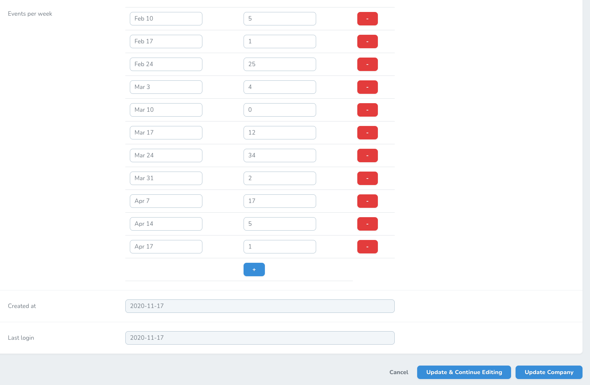
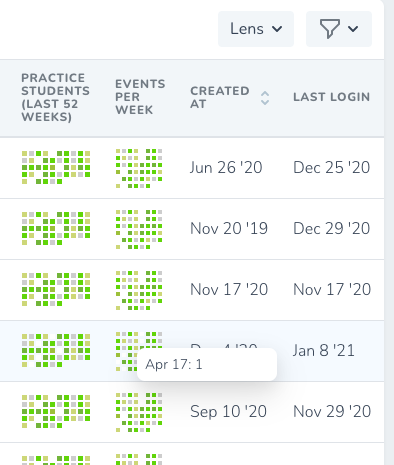

# Laravel Nova Color multi status Field

This field allows to display (and store/edit) multiple values within 1 field as array or object.
It will show values based on color map - as colorful square icons. 
Usually it is stored as json (but that depends purely on an Eloquent model implementation). 

Field accepts both array and object values.
If the data is an object, keys will be editable and will be displayed as tooltips (on hover)

[repository on github](https://github.com/jankapusta/nova-color-multi-status-field)

Possibility to edit values with string keys:



Display colorful squares based on value-to-color mapping. Showing keys on hover:



## Installation

You can install the package in to a Laravel app that uses [Nova](https://nova.laravel.com) via composer:

```bash
composer require jankapusta/nova-color-multi-status-field
```

## Usage

Laravel migration example:

```php
$table->json('guests_per_week');
```


Laravel model example

```php
class Car extends Model {
    protected $casts = [
        'guests_per_week' => 'array',
    ];
    // ....
}

Hotel::create([
    'guests_per_week' => [
      'Feb 10' => 5,
      'Feb 17' => 1,
      'Feb 24' => 12,
      'Mar 3' => 4,
      'Mar 10' => 0,
      'Mar 17' => 8,
      'Mar 24' => 14,
      'Mar 31' => 2,
      'Apr 7' => 9,
    ],
]);

```

Then add a field into Nova Resource

```php
ColorMultiStatus::make('Events per week', 'guests_per_week')
   ->colorMap([
            0 => 'white',
            2 => 'lightgrey',
            5 => '#d3dc83',
            8 => '#a7c742',
            13 => '#7dbd41',
            34 => '#6cda05',
        ])
// optional configuration
  ->iconSize(5) // in pixels - default is 4
  ->iconSpacing(2)   // in pixels - default is 1
  ->showTooltips(false) // to hide tooltips 
  ->width(80), // in pixels
```

## License

The MIT License (MIT). Please see [License File](LICENSE.md) for more information.
